# Docker

## よく使うコマンド

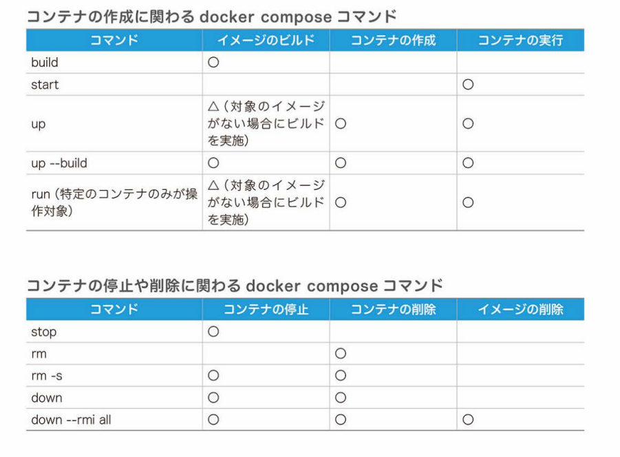

## インストール方法

### 事前準備

#### Windowsの機能の有効化
- Windowsスタートボタンの右横にある検索バーで「Windowsの機能」と検索する
- 検索にヒットした「Windowsの機能の有効化または無効化」をクリックして起動する
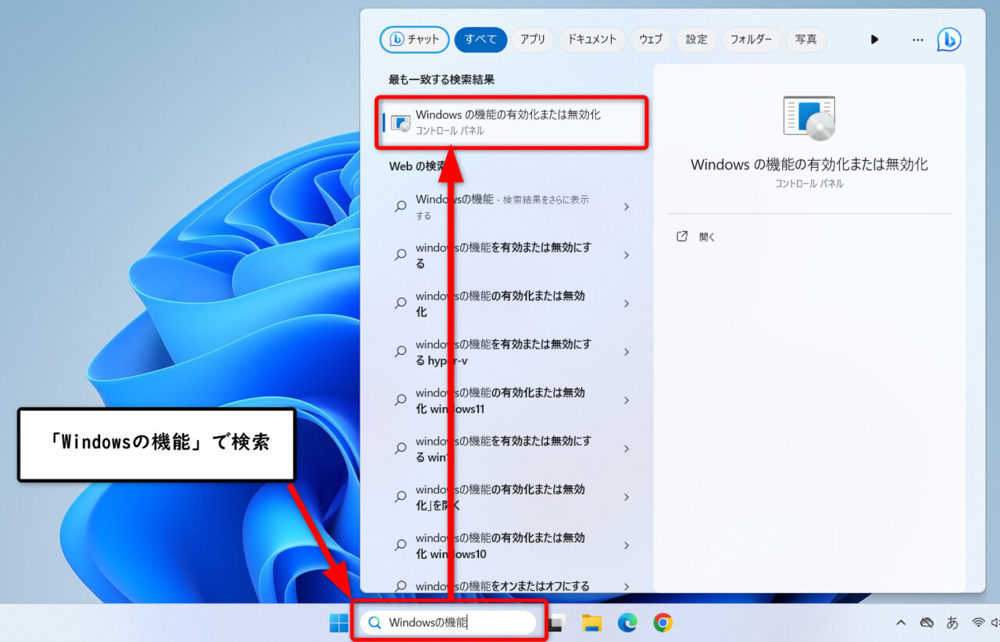

- 下記項目のチェックをONにする
  - 「Linux用windowsサブシステム」
  - 「仮想マシンプラットフォーム」
  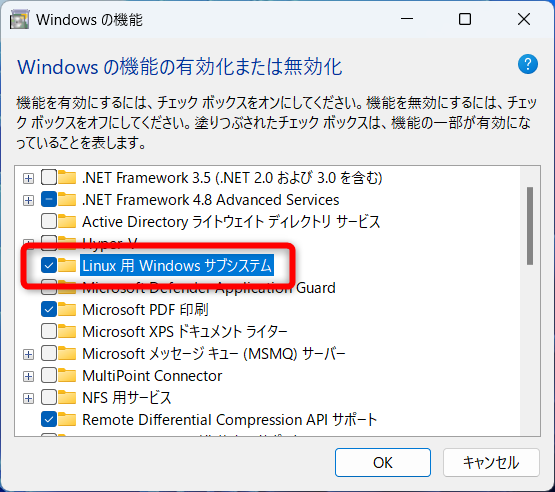  
  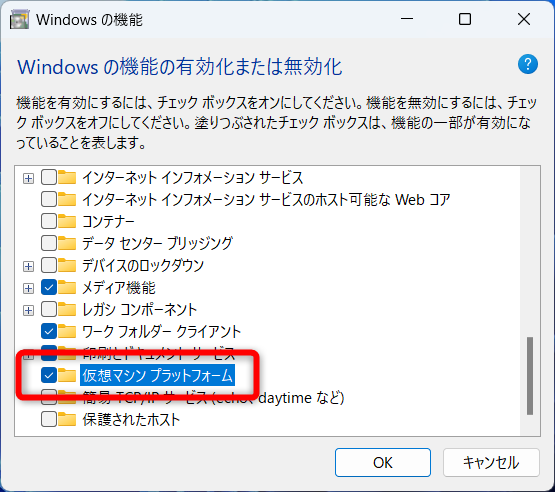

- 有効化されるまで待つ
  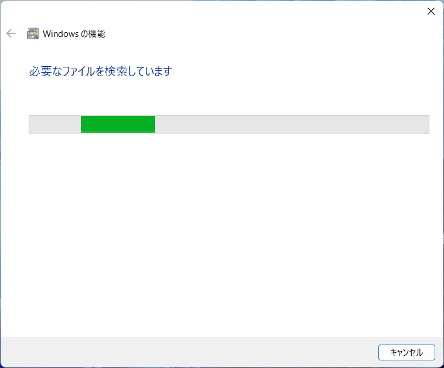

- 消えてはいけないデータが無いか確認してから「今すぐ再起動」をクリック
   

#### x64マシン用WSL2 Linuxカーネル更新プログラムパッケージのダウンロードとインストール
- 下記URLからファイルをダウンロード  
  https://wslstorestorage.blob.core.windows.net/wslblob/wsl_update_x64.msi

- ダウンロードしたファイルを起動  
  

- 「Next」をクリック  
  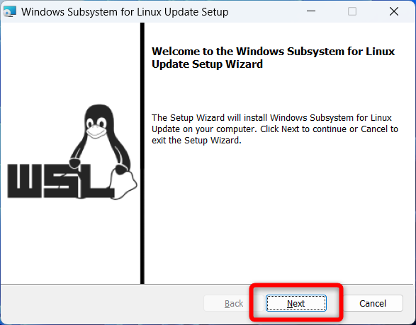

- インストールされるまで待つ  
  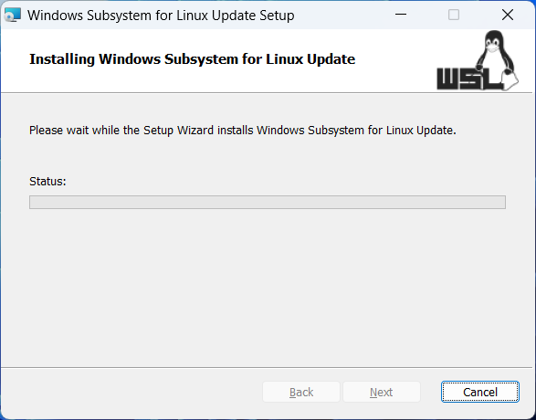

- インストールが完了したら、「Finish」をクリック  
  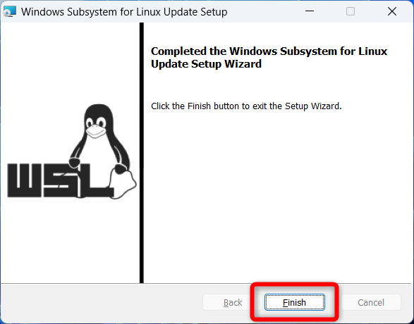

### Dockerのインストール  
- 下記URLからファイルをダウンロード  
  http://docs.docker.com/desktop/install/windows-install/

  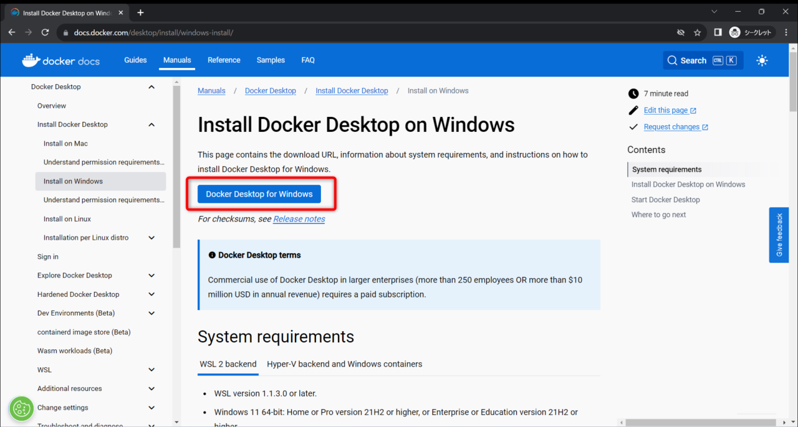

- ダウンロードしたファイルを起動  
  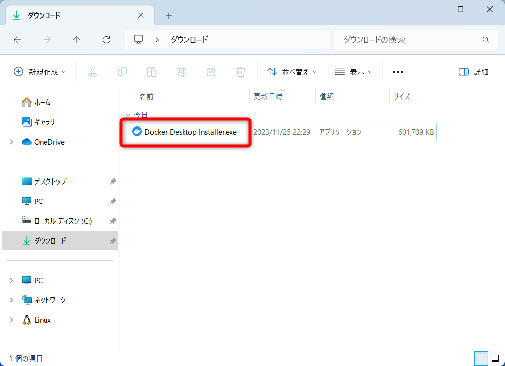

- このまま「OK」をクリック  
  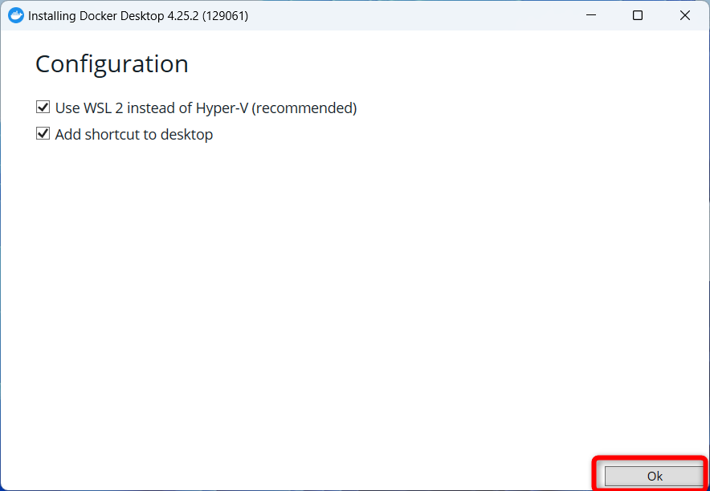

- インストールされるまで待つ  
  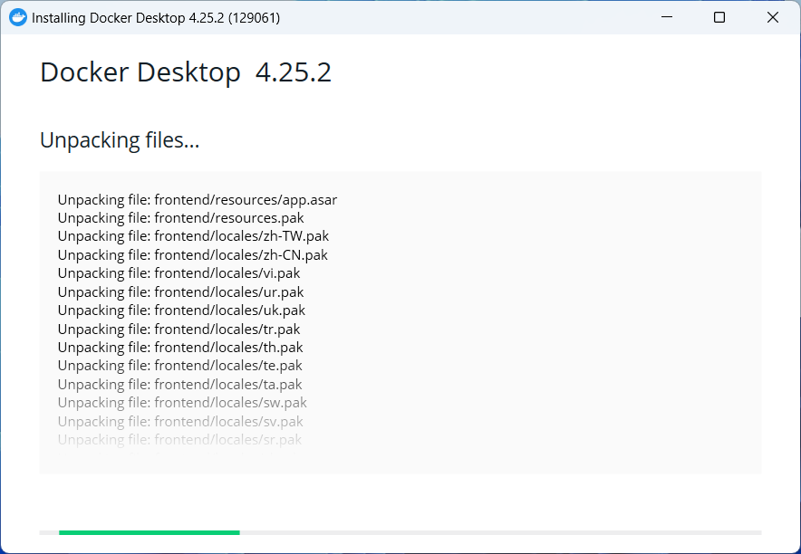

- ログアウトされるので、消えてはいけないデータが無いかを確認して「Close and log out」をクリック
  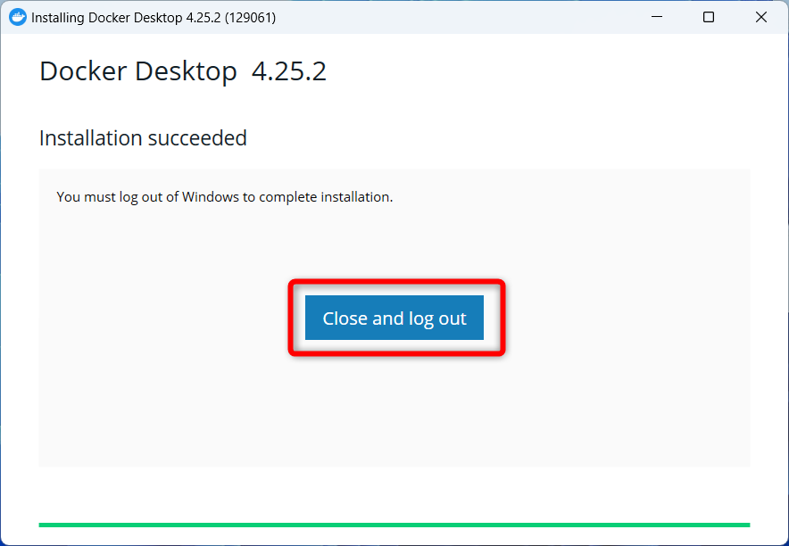

- 「Accept」をクリック  
  

- このまま「Finish」をクリック  
  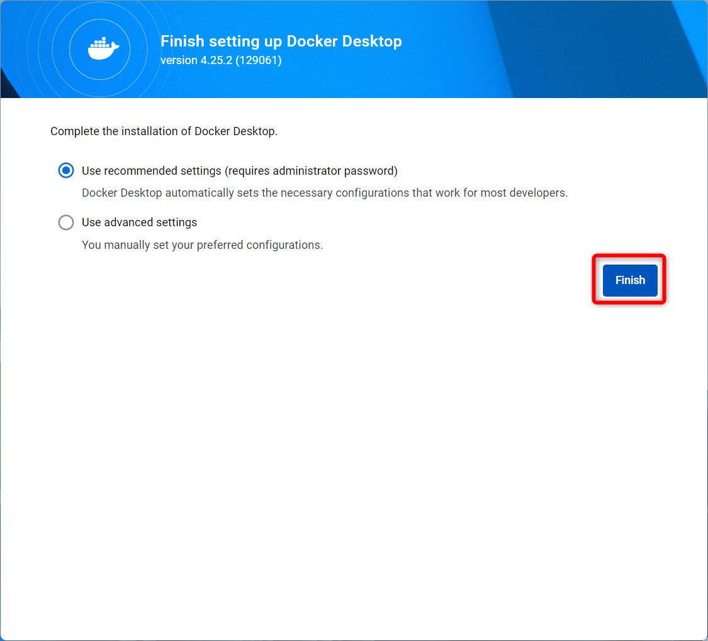

- 「Continue without signing in」をクリック
  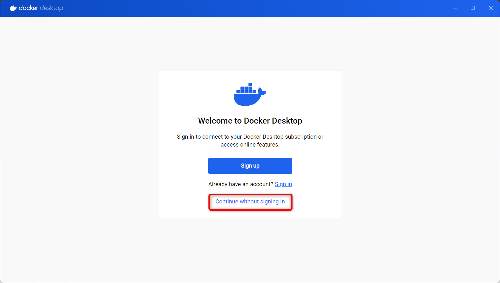

- 「Skip survey」をクリック  
  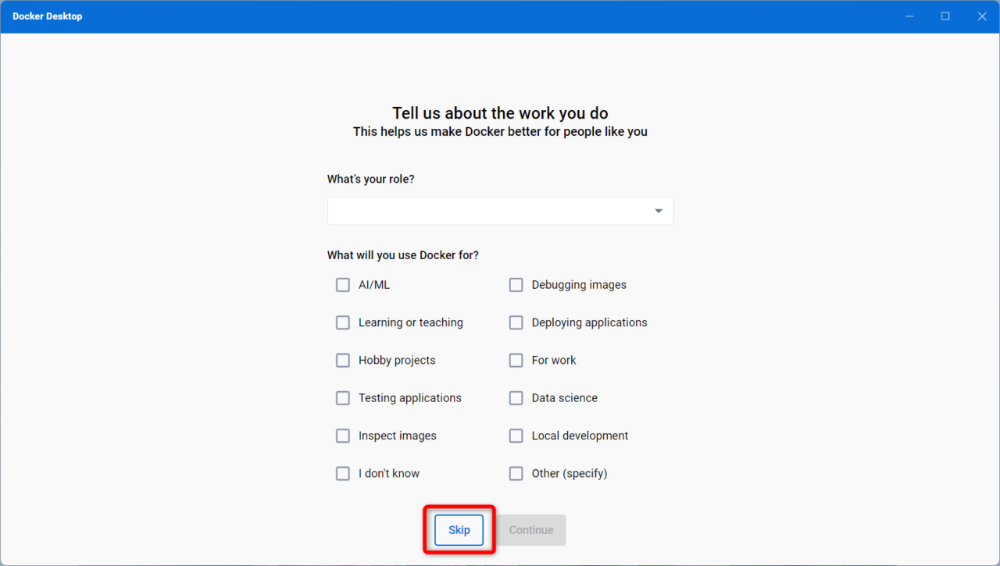

- Dockerのインストール完了  
  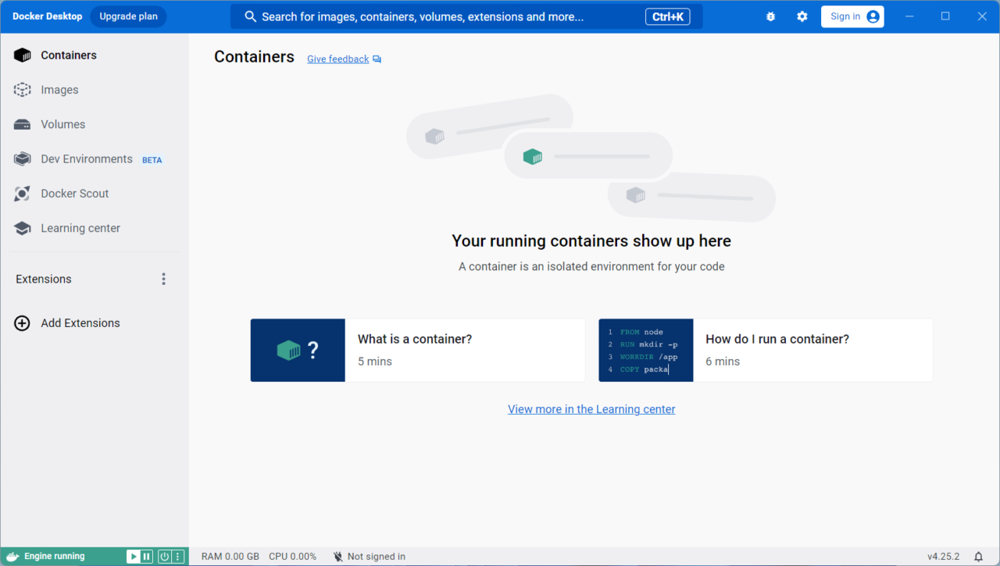

## 「Docker Desktop - Unexpected WSL error」エラーが発生した場合の対処法
  - 管理者権限でコマンドプロンプトを起動
  - 下記コマンドを実行
  ```bash
  wsl --update
  ```
## Dockerの起動コマンド

 ```bash
# Docker起動
docker compose up -d

# Docker終了
docker compose down
```
