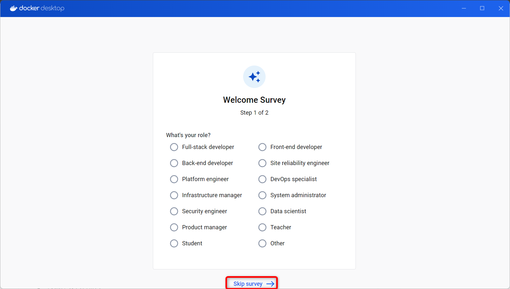

# Docker

## リンク

[Docker でローカル HTTPS 通信を実現](https://qiita.com/li_beiyao/items/fc5720cb053d2b4ba531)

## インストール方法

### 事前準備

#### Windows の機能の有効化

- Windows スタートボタンの右横にある検索バーで「Windows の機能」と検索する
- 検索にヒットした「Windows の機能の有効化または無効化」をクリックして起動する
  

- 下記項目のチェックを ON にする

  - 「Linux 用 windows サブシステム」
  - 「仮想マシンプラットフォーム」  
    

  

- 有効化されるまで待つ  
  

- 消えてはいけないデータが無いか確認してから「今すぐ再起動」をクリック  
   

#### x64 マシン用 WSL2 Linux カーネル更新プログラムパッケージのダウンロードとインストール

- 下記 URL からファイルをダウンロード  
  https://wslstorestorage.blob.core.windows.net/wslblob/wsl_update_x64.msi

- ダウンロードしたファイルを起動  
  

- 「Next」をクリック  
  

- インストールされるまで待つ  
  

- インストールが完了したら、「Finish」をクリック  
  

### Docker のインストール

- 下記 URL からファイルをダウンロード  
  http://docs.docker.com/desktop/install/windows-install/

  

- ダウンロードしたファイルを起動  
  

- このまま「OK」をクリック  
  

- インストールされるまで待つ  
  

- ログアウトされるので、消えてはいけないデータが無いかを確認して「Close and log out」をクリック
  

- 「Accept」をクリック  
  

- このまま「Finish」をクリック  
  

- 「Continue without signing in」をクリック
  

- 「Skip survey」をクリック  
  

- Docker のインストール完了  
  

## コンテナの基本操作 : dokcer container

- コンテナはイメージから作られる
- `docker run`は旧式コマンドで、`docker container run`と同じ

### コンテナを起動する

`docker container run`

```bash
# 練習用コマンド : Hello World
docker container run hello-world

# 練習用コマンド : Ubuntu
docker container run -it ubuntu

# Ubuntuコマンドで動作確認
whoami
cat /etc/os-release
echo $SHELL

# 練習用コマンド : Ubuntu
docker container run ubuntu whoami
```

### コンテナ一覧を確認する

```bash
docker container ls
docker container ls --all
```

### コンテナを停止する

```bash
docker container stop [CONTAINER ID] or [NAMES]
docker container stop cb73dd3cc271
docker container stop blissful_mcclintock
```

### コンテナを削除する

```bash
docker container rm [CONTAINER ID] or [NAMES]
docker container rm cb73dd3cc271
docker container rm blissful_mcclintock

# 起動中のコンテナを矯正削除する
# 用途 : コンテナの停止と削除をまとめて行う
docker container rm -f cb73dd3cc271
docker container rm --force cb73dd3cc271
```

### コンテナ内でインライン実行

参考例 : Ruby をホストマシンにインストールしていなくても、コンテナ内でインライン実行する

```bash
docker container run ruby ruby -e 'print 40 + 2'
```

### コンテナに名前をつける

```bash
docker container run --name hello hello-world
```

### コンテナ停止時に自動で削除する

```bash
docker container run --name hello --rm hello-world
```

### コンテナを対話操作する

よく使うオプション : -it

| ショート      | ロング | 意味                         | 用途                   |
| ------------- | ------ | ---------------------------- | ---------------------- |
| --interactive | -i     | コンテナの標準入力に接続する | コンテナを対話操作する |
| --tty         | -t     | 疑似ターミナルを割り当てる   | コンテナを対話操作する |

```bash
docker container run --rm -it python python3
docker container run --rm --interactive --tty python python3
```

### コンテナのポートを公開する

```bash
docker container run --rm -p 8080:80 nginx
docker container run --rm --publish 8080:80 nginx
```

### コンテナの環境変数を設定する

```bash
# MySQLサーバーを起動する
docker container run --name db --rm --env MYSQL_ROOT_PASSWORD=secret --env MYSQL_USER=app --env MYSQL_PASSWORD=pass1234 --env MYSQL_DATABASE=sample --publish 3306:3306 mysql

# MySQLクライアント
mysql --host=127.0.0.1 --port=3306 --user=app --password=pass1234 sample
```

### コンテナをバックグラウンドで実行する

```bash
docker container run -d
docker container run --detach

# nginxをバックグラウンドで実行する
docker container run --rm -p 8080:80 -d nginx
```

### コンテナの出力を確認する

```bash
docker container logs -f ubuntu
docker container logs --follow ubuntu
```

ログ確認よう(起動失敗するコマンド)

```bash
# 1. envオプションが無いので起動自体失敗する
docker container run --name db --rm --detach --publish 5432:5432 postgres

# 2. --rmを消して終了済みコンテナに残しておく
docker container run --name db --detach --env POSTGRES_PASSWORD=secret --publish 5432:5432 postgres

# 3. ログを確認してみる
docker container logs db
docker container logs -f db
```

## dokcer compose

## コンテナの作成に関わる docker compose コマンド

| コマンド                           | イメージのビルド                           | コンテナの作成 | コンテナの実行 |
| ---------------------------------- | ------------------------------------------ | -------------- | -------------- |
| build                              | ○                                          |                |                |
| start                              |                                            |                | ○              |
| up                                 | △ (対象のイメージがない場合にビルドを実施) | ○              | ○              |
| up --build                         | ○                                          | ○              | ○              |
| run (特定のコンテナのみが操作対象) | △ (対象のイメージがない場合にビルドを実施) |                | ○              |

## コンテナの停止や削除に関わる docker compose コマンド

| コマンド       | コンテナの停止 | コンテナの削除 | イメージの削除 |
| -------------- | -------------- | -------------- | -------------- |
| stop           | ○              |                |                |
| rm             |                | ○              |                |
| rm -s          | ○              | ○              |                |
| down           | ○              | ○              |                |
| down --rmi all | ○              | ○              | ○              |

## エラー対策が発生した場合の解決策

### 「クラスが登録されていません」エラーが発生した場合

エラー内容

```
クラスが登録されていません
エラー コード: Wsl/CallMsi/Install/REGDB_E_CLASSNOTREG
```

解決策

下記サイトから`wsl.2.3.26.0.x64.msi`をダウンロードしてインストールする

https://github.com/microsoft/WSL/releases

### 「Docker Desktop - Unexpected WSL error」エラーが発生した場合

- 管理者権限でコマンドプロンプトを起動
- 下記コマンドを実行

```bash
wsl --update
```

## Docker の起動コマンド

```bash
# Docker起動
docker compose up -d

# Docker終了
docker compose down
```
